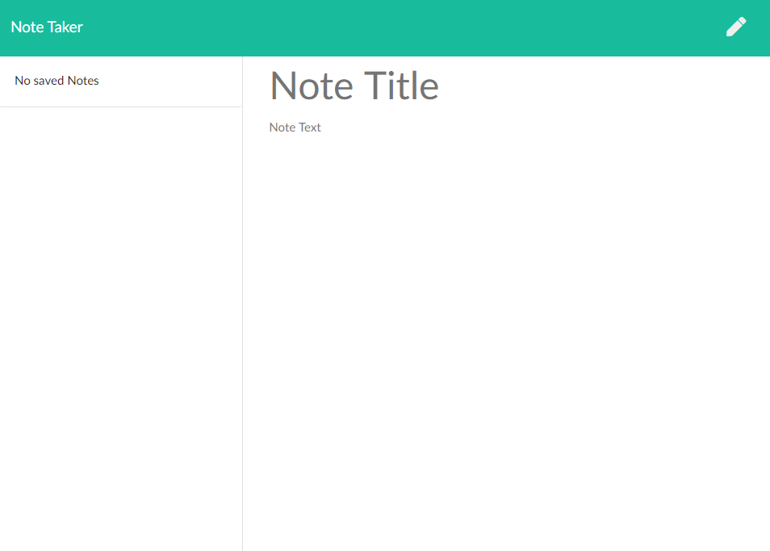

### Project Name 
# Note Taker asdf 

## Description
A little app to take notes with, uses express for routing and a simple JSON file for the database  
## Table of Contents  
- [Description](#description)
- [Installation](#installation)
- [Usage](#usage)
- [License](#license) 
## Media
  
## Installation  
Clone repo and run "npm install"
## Usage
Enter a title and some content and click the save button in the top right corner to add a new note, click the trash can to delete a note.

## License
This application is covered under the AGPLv3 license.

